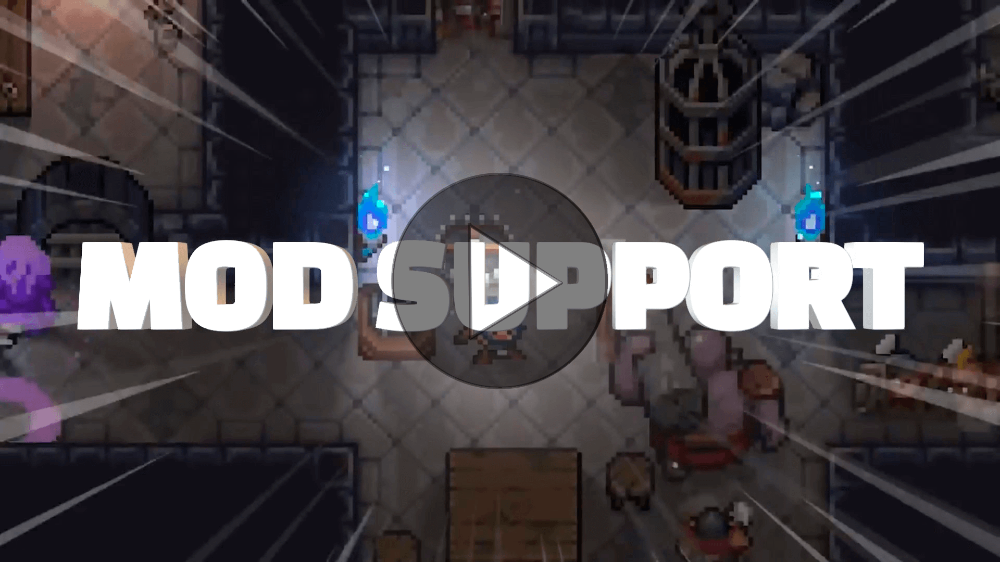

# Dwerve Mods
Watch this 4-minute video and see how quick and easy it is to make your own mods for [Dwerve](https://store.steampowered.com/app/1132760/Dwerve/)!

[](https://youtu.be/0PtbafPWmwE)

## Overview
This repository includes documentation on how to create mods for the game [Dwerve](https://store.steampowered.com/app/1132760/Dwerve/). It also contains source code for official Dwerve [Mods](Mods) as well as [Templates](Templates) that you can copy and edit in order to make your own mods quickly and easily. The templates include easy-to-read TOML files which define mods, as well as spritesheets which you can edit with any sprite editor.

## Capabilities
The mod system lets you customize the stats and sprites for Dwerve, towers, and enemies. You can also mod the general game configuration which determines when towers, power stones, and artifacts get unlocked. For example, you could reskin a turret, have it deal massive knockback, and unlock it in the first level.

## File Format
Dwerve uses [TOML](https://TOML.io/en) to describe mods. TOML is a config file format that is easy to read and write. To create a new mod, just download the mod's template folder and edit any TOML and image files. For editing sprites, we recommend using [Aseprite](https://store.steampowered.com/app/431730/Aseprite/), but [Piskel](https://www.piskelapp.com/) is a free online pixel software that also works well. There are templates for modding [Dwerve](Templates/Dwerve), [Towers](Templates/Towers), [Enemies](Templates/Enemies), and [Configuration](Templates/Configuration).

## Example Mod
Template TOML files such as [Dwerve.Stats.toml](Templates/Dwerve/Dwerve.Stats.toml) contain every moddable stat and their default values. You can ignore the lines for stats you don't want to change or delete them if you prefer to keep the TOML concise. Here is the TOML for the [Super Fast Walk](Mods/SuperFastWalk/SuperFastWalk.toml) mod that doubles Dwerve's movement speed which is 4.3 by default:

```TOML
ModTarget = "Dwerve"

[Stats]
Speed = 8.6
```

## CurseForge
All mods including both official and user-created ones are hosted on [CurseForge](https://www.curseforge.com/dwerve/mods), a platform that lets you browse, download, and manage mods from their website and the in-game UI. On CurseForge, you can also publish your own mods by selecting [Start a project](https://www.curseforge.com/project/80345/6101/create) from the Create menu and then uploading a ZIP file that contains the TOML and image files for your mod.

## Official Mods

* [All Artifacts](Mods/AllArtifacts)
* [Anytime Dash](Mods/AnytimeDash)
* [Complete Arsenal](Mods/CompleteArsenal)
* [Endless Smash](Mods/EndlessSmash)
* [Forever Traps](Mods/ForeverTraps)
* [Funny Chakram](Mods/FunnyChakram)
* [Long-Range Scattershot](Mods/LongRangeScattershot)
* [Red Hair](Mods/RedHair)
* [Turd Slimes](Mods/TurdSlimes)
* [Super Fast Walk](Mods/SuperFastWalk)
* [Ten Power Stones](Mods/TenPowerStones)
* [Wicked Fast Wargboars](Mods/WickedFastWargboars)

## Join our Community
Want to share your mod or ask the devs a question? Join the [Half Human Games Discord](https://discordapp.com/invite/halfhumangames) and follow [@HalfHumanGames](https://twitter.com/intent/user?screen_name=HalfHumanGames) on Twitter! Report any mod-related bugs via the [Issue Tracker](https://github.com/HalfHumanGames/DwerveMods/issues). We look forward to seeing what cool mods you create! Happy modding!
___
*Copyright © 2019 Half Human Games, Inc. All Rights Reserved.*
